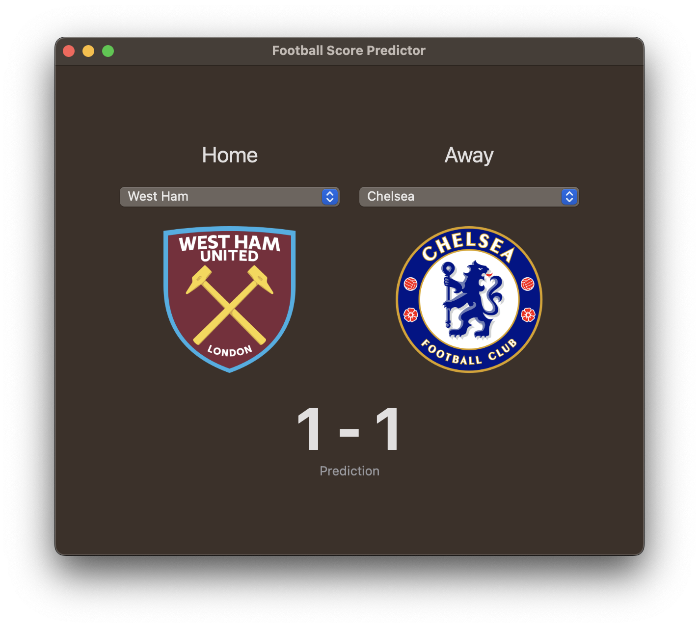

# Football Score Predictor

An L&D project looking at using CoreML to predict football scores for teams from the English Premier League.

## Overview

CreateML uses football results from the English Premier League between 2016-2022 seasons to train two ML models. One model predicts the home score from the home team and away team, while the other model predicts the away score from the home team and away team.

## Instructions

Use the Playground to generate the CoreML models and team name list.

To update the models add them to the Xcode project.

## The app

Simply choose a home team and an away team, and the CoreML models will predict the home and away score.

## Resources

* Football results data from [https://fixturedownload.com](https://fixturedownload.com)
